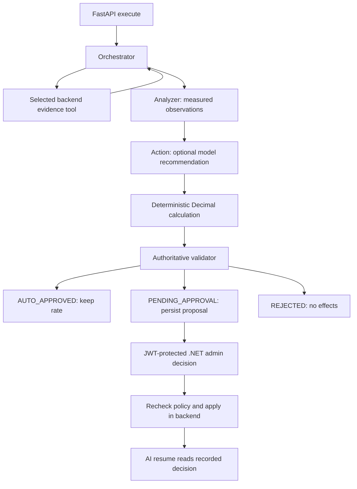

# OpenParking AI pricing workflow

FastAPI and PlannerAgent remain the entry points. Dynamic pricing uses a dedicated,
bounded LangGraph. Existing overstay, permit, mapping and routing endpoints remain.



The orchestrator requires zone capacity/rate, pricing configuration and price history.
It selects additional demand evidence based on occupancy, event hints or model choice.
There are at most five tool iterations and an independent graph recursion limit.
Tools are allowlisted: no model-supplied URLs or executable code are accepted.

The analyzer calculates occupancy, arrival pressure and net arrival/departure trend
from actual measurements. Demand may differ from occupancy when arrivals or confirmed
upcoming reservations are high. Confidence is an evidence-completeness heuristic, not
a calibrated probability. Unavailable measurements are named, including historical
occupancy, for which this project has no reliable snapshot source.

Supported proposals: KEEP_PRICE, INCREASE_PRICE, REQUEST_MANUAL_REVIEW. Moderate
occupancy alone maintains the current price. High/critical demand uses configured
multipliers and the existing 0.2 adjustment for high measured arrival pressure.
Low occupancy never surges. Every monetary zone change requires an admin, matching
the existing backend approval architecture. Reservation limiting and automatic price
decreases are deferred rather than inventing unsupported operational capabilities.

The validator checks finite/nonnegative values, arithmetic, configured maximum surge,
min/max hourly rates, pricing enablement, cooldown and approval requirements. An LLM
cannot override a failed check. Recent changes produce a no-change proposal. A rate
matching the last approved proposal also stays unchanged after cooldown, preventing
successive evaluations from compounding an already surged zone rate. Manual zone rate
edits are audited and participate in cooldown. An admin can manually reconsider rates.

The backend rechecks policy, original rate, arithmetic and cooldown at approval time.
Concurrent edits are detected through the zone rate concurrency token. Pending and
rejected proposals never claim applied effects. No-op evaluations use Completed in
.NET and AUTO_APPROVED in AI; they do not record an admin approval.

The legacy `/ai/pricing/surge` endpoint remains a deterministic booking calculator.
Its multiplier is capped, and BookingService sends/enforces its configured cap itself.
The existing booking-time surge behavior is preserved: workflow proposals concern
BaseHourlyRate rather than introducing a separate billing-rate database model.

## Configuration

Use the repository root `.env`; never put these in frontend VITE variables:

```dotenv
AI_REASONING_PROVIDER=gemini
GEMINI_API_KEY=your-private-key
GEMINI_MODEL=gemini-2.5-flash
INTERNAL_API_TOKEN=one-random-secret-shared-by-api-and-ai
API_BASE_URL=http://localhost:5000
AI_SERVICE_URL=http://localhost:8000
```

Cloudflare remains supported via `AI_REASONING_PROVIDER=cloudflare`, the existing
CF_ACCOUNT_ID, CF_AI_TOKEN, CF_AI_MODE=live and optional CF_AI_GATEWAY. Set the provider
to `disabled` for deterministic reasoning. Gemini uses the existing httpx dependency,
JSON-schema output and Pydantic validation. Provider errors, missing credentials,
timeouts and malformed responses fall back to deterministic logic with the same guard.

Both Compose files pass credentials to server containers. Recreate existing containers
after changing environment values. The shared internal token must be set on both API
and AI; missing credentials disable internal endpoint access. Cloudflare mock mode
only disables model reasoning for pricing; backend tools still read actual data.

New SystemSettings are seeded without overwriting existing values:

- `pricing.price_change_cooldown_minutes`: 30
- `pricing.min_hourly_rate`: 0
- `pricing.max_hourly_rate`: 1000 (also respects the existing zone rate limit)
- `pricing.auto_approve_confidence`: 0.85, for no-change decisions only

Existing pricing enablement, cap and demand multipliers come from `/api/settings`.
A failed required configuration read rejects the workflow instead of substituting
production policy defaults. Defaults for the newly added settings support databases
that have not yet restarted to run the existing settings seeder.

## Execution and human review

Admins can call `POST /api/agent/workflows/pricing/{zoneId}` with their existing JWT.
Existing FastAPI `/workflows/plan`, `/workflows/execute`, `/workflows/{id}` and
`/workflows/resume` endpoints remain. A direct AI request needs a UUID workflow ID
and a real zone UUID; supplied measurements never override live backend information.

```json
{
  "workflow_id": "a2cb52a6-5e86-45d8-b6c2-29a678848e8e",
  "workflow_type": "DYNAMIC_PRICING",
  "zone_id": "PUT-A-REAL-ZONE-UUID-HERE",
  "objective": "Evaluate this zone and determine whether pricing needs review",
  "input_data": {"trigger_event": "arrival_spike"}
}
```

Event hints are optional; no event infrastructure was added. Reuse a workflow UUID
for idempotent retries, and create a new UUID for a fresh evaluation. The existing
admin UI lists pending workflows and shows persisted evidence/proposals in its JSON
views. Actual approvals/rejections use existing protected .NET endpoints.

FastAPI resume does not trust an APPROVE request or an actor name as authorization.
It reads the recorded backend decision and stays pending until an admin acts. The
backend stores the full state in the existing PlanJson field, with the outline under
`plan`. StepResultsJson retains the flat proposal expected by approval code. This
provides a durable checkpoint across AI restarts without a new checkpoint database.
No migration is needed: workflow statuses already use a string column.

The .NET-triggered flow saves the AI response itself, avoiding competing Python
updates. Direct FastAPI executions submit proposals via the service endpoint; failed
persistence produces FAILED rather than claiming the result is durable.

## Added backend capabilities

Every `/api/agent/pricing/*` route requires the shared service token and cannot grant
admin approval:

- `GET zones/{id}/demand`: 15-minute session arrivals/departures and confirmed
  reservations starting in the next hour, without personal information.
- `GET zones/{id}/price-changes`: actual approved pricing workflows and manual zone
  rate audit entries; pending/no-change proposals are excluded.
- `GET workflows/{id}`: durable pricing state and actual admin metadata for resume.
- `PUT workflows/{id}`: proposal/no-change persistence, never applied monetary actions
  or admin approval; reviewed/submitted proposals cannot be overwritten by a replay.

These were needed because existing session/booking endpoints expose personal records,
and the existing workflow controller requires admin JWTs and has no service proposal
write API. Existing read-only zone detail and settings endpoints are reused directly.

## Observability and verification

State includes identifiers, goal, observations, tool results, analysis, proposals,
validation and final decision. The trace records executed nodes and tools. Structured
logs include identifiers, tool names and outcomes without secrets or raw HTTP errors.

Pytest explicitly sets `ENVIRONMENT=testing` for supplied snapshot fixtures and local
checkpoints. Compose does not set it. Do not deploy with this testing flag.

From the repository root:

```powershell
python -m pytest ai/tests -q
dotnet test api/OpenParking.Tests/OpenParking.Tests.csproj
```

Tests cover occupancy levels, velocity, reservations, cap rejection, invalid inputs,
cooldown, non-compounding repeated evaluations, uncertainty, repeatable arithmetic,
API and LLM failures, structured Gemini output, persistence failures and actual admin
approval. Backend tests verify internal credentials, aggregate privacy, stale pricing,
approval policy, persisted state and approval idempotency.
