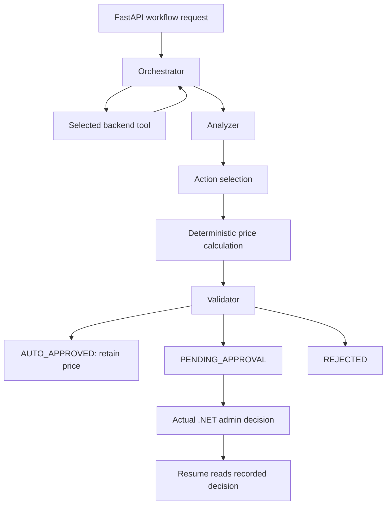

# AI Agent Update Report

The main change is that **`DYNAMIC_PRICING` now runs as a stateful workflow that gathers backend evidence, optionally uses Gemini to select an action, and passes every proposal through deterministic validation.** FastAPI, the existing agent classes, and the .NET admin approval flow remain.

The refactor focused on pricing. Overstay enforcement, permit validation, cartography, and routing were preserved; they have not all been converted into adaptive agent workflows.

## 1. How the system worked before

The previous pricing flow followed a predefined plan:

```text
Analyzer → Action → Approval checkpoint → “Apply pricing”
```

Its main problems were:

- The planner always generated the same sequence.
- Missing pricing inputs were replaced with sample defaults.
- The analyzer asked an LLM to calculate occupancy and velocity.
- The mock analyzer returned the same critical assessment regardless of input.
- Pricing did not pass through an authoritative pricing validator.
- The AI “apply” step returned `applied: true` without actually changing the backend.
- Workflow persistence attempted backend routes that did not provide the required service persistence capability.

The .NET backend already had actual admin approval and rate-update logic. The new pricing workflow uses that existing authority.

## 2. PlannerAgent and orchestration

Changed [planner.py](ai/agents/planner.py) and added [pricing_workflow.py](ai/agents/pricing_workflow.py).

`PlannerAgent` now delegates `DYNAMIC_PRICING` execution to a dedicated `PricingWorkflow`. Other workflow types continue through the existing planner.

The pricing plan is now an outline of responsibilities:

```text
Gather evidence → Analyze → Propose → Validate
```

The graph decides which data calls occur during execution:



Three observations are mandatory because pricing cannot safely proceed without them:

- Actual zone capacity, occupancy, and current rate.
- Pricing configuration.
- Recent price-change information.

Additional demand evidence is collected when occupancy, an event hint, or a model recommendation makes it useful.

The workflow allows **at most five tool iterations**, with an additional LangGraph recursion limit. It also checks for an existing result under the same workflow ID to support idempotent retries.

## 3. Shared workflow state

The graph preserves:

| Information | Purpose |
|---|---|
| Workflow, zone, and session IDs | Identify the execution and its context |
| Goal and input data | Record what the workflow was asked to evaluate |
| Observations and tool results | Preserve evidence and tool failures |
| Analysis and confidence | Explain the demand assessment |
| Proposed actions | Record the recommendation |
| Validation results | Record deterministic policy checks |
| Final decision and reason | Explain the outcome |
| Approval requirement and `applied` flag | Distinguish proposals from actual effects |
| Iteration count and trace | Show execution progress and enforce limits |
| `llm_failed` | Identify use of deterministic fallback |

This makes the result reviewable instead of returning only a multiplier.

## 4. AnalyzerAgent

Changed [analyzer.py](ai/agents/analyzer.py).

The analyzer now calculates measurements directly from validated observations. It no longer relies on an LLM for occupancy arithmetic.

Its structured assessment includes:

- `occupancy_rate`
- `velocity_score`
- `congestion_level`
- `demand_level`
- `trend`
- `requires_surge_pricing`
- `confidence`
- `factors`
- `unavailable_data`

The occupancy thresholds are:

| Occupancy | Congestion |
|---|---|
| Below 50% | LOW |
| 50%–below 70% | MODERATE |
| 70%–below 90% | HIGH |
| 90% and above | CRITICAL |

Arrival pressure uses arrivals in the previous 15 minutes relative to capacity. Trend is based on arrivals minus departures during that window.

**Demand can differ from occupancy.** For example, moderate occupancy can produce HIGH demand when arrival pressure is high or confirmed upcoming reservations are substantial.

Missing measurements remain explicitly unavailable. Historical occupancy is currently reported as unavailable because the project does not have a reliable occupancy-history source.

Confidence is an **evidence-completeness heuristic**, not a calibrated probability of correctness.

## 5. ActionAgent and action proposals

Changed [action.py](ai/agents/action.py), with action selection coordinated by the new pricing graph.

The workflow currently generates three actions:

| Action | Meaning |
|---|---|
| `KEEP_PRICE` | Retain the existing rate |
| `INCREASE_PRICE` | Propose a deterministically calculated increase |
| `REQUEST_MANUAL_REVIEW` | Ask an administrator to review without changing the price |

A proposal includes the action, current rate, proposed rate, multiplier, measured justification, and confidence. Compatibility fields such as `calculated_rate` and `base_rate` remain available for existing callers.

Pricing behavior now includes these rules:

- Low occupancy cannot produce a surge increase.
- Moderate occupancy alone normally retains the current price.
- High or critical demand can generate an increase proposal.
- High measured arrival pressure retains the existing `0.2` multiplier adjustment for HIGH/CRITICAL demand.
- A model request to increase pricing without sufficient demand becomes manual review.
- A zero current rate is sent for manual review rather than multiplied into an ineffective increase.
- Keeping the price preserves its existing precision.

The model cannot choose an arbitrary price or multiplier. Money is calculated using `Decimal` and explicit rounding.

LLM initialization in `ActionAgent` is now lazy, so pricing calculations do not require a working model connection.

## 6. ValidatorAgent

Changed [validator.py](ai/agents/validator.py).

Added an authoritative `validate_pricing_proposal()` method. It checks:

- Invalid, negative, or nonfinite monetary inputs.
- Whether the proposed rate matches the calculation.
- `pricing.max_surge_multiplier`.
- Configured minimum and maximum hourly rates.
- Whether the action matches the direction of the price change.
- Whether pricing is enabled.
- Whether price history is available for a change.
- Whether the cooldown is active.
- Whether confidence is valid.
- Whether administrator approval is required.

The decisions are:

| Condition | Decision |
|---|---|
| Valid no-change result with sufficient confidence | `AUTO_APPROVED` |
| Valid price change, manual review, or insufficient confidence | `PENDING_APPROVAL` |
| Invalid evidence or failed policy validation | `REJECTED` |

**Every actual zone price change requires admin approval.** An LLM cannot override a failed validator result.

## 7. Backend tools

Added [pricing.py](ai/tools/pricing.py).

The tool layer provides:

| Tool | Data source |
|---|---|
| `get_zone_status` | Existing zone-detail endpoint |
| `get_pricing_config` | Existing settings endpoint |
| `get_reservation_demand` | New aggregate demand endpoint |
| `get_recent_price_changes` | Approved workflows and manual rate-change audit records |
| `calculate_dynamic_rate` | Deterministic Python function |
| `submit` / `fetch` | Backend proposal persistence and retrieval |

Zone capacity excludes maintenance slots. Occupied slots count physical occupancy; reservations are assessed separately.

The demand endpoint returns aggregate counts:

- Arrivals during the previous 15 minutes.
- Departures during the previous 15 minutes.
- Confirmed reservations starting during the next hour.

It does not return driver identities or licence plates.

Required tool failures stop safe pricing evaluation. Optional demand-tool failures leave the measurements unavailable and reduce evidence completeness. HTTP calls have timeouts.

## 8. Gemini integration

Added [reasoning.py](ai/tools/reasoning.py).

Gemini is used for two limited decisions:

- Whether additional demand evidence would help.
- Whether to keep pricing, propose an increase, or request manual review.

The response is constrained to a JSON schema and validated again with Pydantic. Unknown tools, unsupported actions, and extra fields such as model-generated prices are rejected.

Cloudflare remains available as an alternative provider. Reasoning can also be disabled.

If the model times out, returns malformed output, or becomes unavailable, the workflow uses deterministic fallback behavior and keeps the same validation and approval requirements.

The Gemini connection was tested successfully with synthetic parking data. The local model-name typo was corrected to `gemini-2.5-flash`.

## 9. Human approval and persistence

Added [AgentPricingController.cs](api/OpenParking.Api/Controllers/AgentPricingController.cs) and updated the existing enforcement integration.

Pending proposals are stored in the backend:

- `PlanJson` contains the full pricing state.
- `StepResultsJson` retains the flat proposal expected by approval code.

The AI service can retrieve that state after restarting.

Calling `/workflows/resume` with `APPROVE` or an `approved_by` name does **not** establish authorization. Pricing resume reads the actual backend approval status and administrator metadata.

The .NET approval service rechecks:

- The current zone rate against the original proposal.
- Pricing arithmetic and action consistency.
- Current limits and pricing enablement.
- Cooldown at the time of approval.
- Saved deterministic validation.

A concurrency token on the zone rate detects competing edits.

The new internal service credential permits aggregate reads and proposal persistence. It cannot grant administrator approval or directly apply a monetary change.

## 10. Cooldown and repeated-surge protection

Added these settings through the existing settings seeder:

| Setting | Default |
|---|---:|
| `pricing.price_change_cooldown_minutes` | 30 |
| `pricing.min_hourly_rate` | 0 |
| `pricing.max_hourly_rate` | 1000 |
| `pricing.auto_approve_confidence` | 0.85 |

Recent approved changes normally produce `KEEP_PRICE`.

There is also protection against repeatedly multiplying an already increased rate: when the current rate matches the latest approved pricing proposal, another increase recommendation becomes `KEEP_PRICE`.

Manual zone-rate edits are now audited and participate in cooldown checks.

## 11. Compatibility and backend changes

Existing FastAPI workflow endpoints remain available.

The legacy `/ai/pricing/surge` endpoint remains a deterministic booking calculator. It now validates numeric inputs and caps its result. `BookingService` sends the configured cap and independently limits the returned multiplier.

An administrator can initiate evaluation through:

```text
POST /api/agent/workflows/pricing/{zoneId}
```

Optional event hints such as `arrival_spike` and `reservation_demand_spike` can influence evidence gathering. No event queue or large event infrastructure was introduced.

Both Compose files and `.env.example` were updated for Gemini and the shared internal credential.

## 12. Verification and remaining scope

The completed implementation passed:

- **64 AI tests**
- **99 backend tests**
- AI lint checks
- A live Gemini structured-response check

Coverage includes occupancy levels, arrival velocity, reservations, invalid inputs, surge caps, cooldowns, repeated-surge protection, deterministic arithmetic, tool failures, model failures, persistence failures, stale proposals, and actual admin approval.

The remaining limitations are explicit:

- Historical occupancy analysis is unavailable.
- Automatic price decreases and reservation limiting are not generated.
- The model’s explanation field is accepted, but the current proposal justification is built from measured factors.
- Pricing state is persisted after evaluation; individual tool calls are not durable mid-execution checkpoints.
- Existing booking-time surge behavior remains alongside zone base-rate proposals.
- Overstay and permit workflows retain their previous orchestration. The existing overstay proposal still uses an LLM and needs a separate safety-focused refactor.

The implementation and demonstration guide is in [ai/README.md](ai/README.md).
