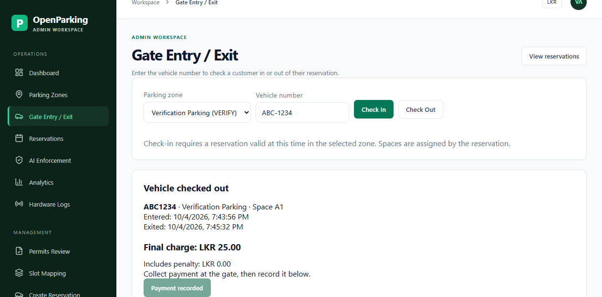

# Customer app and attendant gate changes

Verified on 2026-10-04.

The customer reserves a space with a vehicle number. An authorized attendant opens **Gate Entry / Exit**
in the admin panel, selects the zone, and enters that number to check the vehicle in or out.
Checkout calculates the final charge and releases the space. The attendant collects payment at the gate
and records it; the customer sees the completed session, final charge, payment status, and receipt in **My Bookings**.

QR screens, scanning, parsing, generated passes, and mobile QR dependencies have been removed.
The unused database QR column remains for schema compatibility and is excluded from API responses.
No database migration is required for these changes.

Other fixes:

- Home shortcuts navigate to actual parking, bookings, penalties, and permit screens.
- Booking history uses real reservations and sessions, supports pagination, cancellation, and refreshes every 30 seconds.
- Account details come from the signed-in user's profile; cached tokens are validated and expired sessions sign out.
- Zone search/filtering and pagination use backend results; failures are shown rather than presented as empty lists.
- Permit upload uses the customer's ID and the backend document/authority fields. Status comes from stored permits.
- Penalty lists filter by customer before pagination; disputes store the submitted explanation and display configured currency.
- Indoor navigation follows saved connected waypoints with the actual map dimensions. Unmapped spaces show an explanation.
- Password recovery uses a 20-minute emailed code invalidated by a password change.
- Receipts display the completed session's charge and payment state and can be copied. The fake PDF URL was removed.
- Driver accounts cannot operate attendant gate or session entry/exit endpoints.

Verification evidence:

| Check | Result |
| --- | --- |
| Flutter analysis | No issues |
| Flutter tests | 10 passed |
| Android debug build | APK built successfully |
| Backend tests | 83 passed |
| Admin production build, lint, tests | Build/lint passed; 11 tests passed |
| Real HTTP booking → gate entry → exit → payment → customer history | Passed with disposable in-memory data |
| HTTP permit submission/status and penalty filtering/disputes | Passed |
| Browser gate entry/exit/payment | Passed; checkout displayed LKR 25.00 and payment button changed to Payment recorded |

The browser/API verification used the [disposable verification host](../tools/verify-customer-flows/README.md).
Email and AI calls were isolated in that host; production database and provider integration were not exercised.
Password-reset delivery requires the configured Resend service. Navigation requires a published floor plan
with connected waypoints and a mapped space. iOS and physical-device camera/gallery behavior still require device testing.

