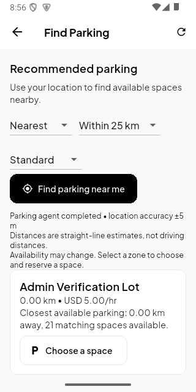

# Find Parking recommendation flow

Find Parking now requests foreground device location and calls a read-only LangGraph parking agent through the authenticated .NET API. The home button starts the flow automatically. Selecting the Find Parking tab starts it too; the background tab never asks for location. Users can retry with “Find parking near me.”

## Mobile

- Added `ParkingLocationService` using geolocator and Android/iOS foreground permissions. Android uses the native location manager. Service checks and GPS acquisition have timeouts; denied permission, disabled location, failed GPS, and network failures keep normal browsing available.
- Added `ParkingRecommendationService` and a recommendation panel with nearest/cheapest/balanced preferences, 5/25/100 km radii, and Standard/EV/Accessible space types.
- Results show names, prices, matching availability, distance, location accuracy, and the selection reason. “Choose a space” opens the existing blueprint and reservation flow with the recommended space type.
- Device location is acquired on demand; no background tracking was added. Recommendations do not automatically reserve or pay.

## Backend and agent

- New authenticated `POST /api/parking/recommendations` validates latitude, longitude, radius, preference, and space type. Accessible requests require an administrator-verified, unexpired disability permit.
- The API queries current matching available slots, excludes legacy unset `(0,0)` entrance coordinates, computes Haversine distances, and supplies at most 50 ranked nearby candidates to the internal AI service. Price comparisons use the configured system currency.
- New internal-token-protected `POST /ai/parking/recommend` runs `ParkingFinderAgent`: filter evidence → rank candidates → validate results. It returns up to three recommendations, a request ID, and completed steps. Unknown zone IDs are rejected by the API.
- Nearest sorts by distance; cheapest by hourly rate then distance; balanced weights normalized distance at 70% and price at 30%. These are explicit deterministic rules in a LangGraph agent, without an LLM call or Gemini charges.
- The Python service receives candidate distances, not raw driver coordinates. No driver GPS coordinates are persisted by this feature.
- Service failures return an actionable 503 instead of pretending an agent completed.

## Practical limits

- Distances are straight-line distances to administrator-saved entrance coordinates, not road routes or driving ETAs.
- Availability is a snapshot. The existing reservation endpoint validates the selected space again when booking.
- Lots must have correct entrance coordinates and matching available spaces inside the selected radius. The agent does not discover unregistered parking lots.
- Android emulator GPS is simulated. Test with an Extended Controls location near a configured lot; the emulator's default location may be in another country.
- iOS location permission is configured, but this Windows environment cannot verify an iOS build.

## Verification

New tests cover ranking, radius exclusion, duplicate evidence, empty results, invalid observations, internal authentication, authenticated API input validation, permit restrictions, geographic distances, live evidence transfer, invented-zone rejection, missing service configuration, mobile GPS denial, and mobile agent calls. Existing mobile layout tests cover 320/390/800 px widths and increased text size.

Final results: **93 AI tests, 115 backend tests, and 27 mobile tests passed**. Flutter analysis reported no issues and the debug APK built successfully. The API and AI Docker containers were rebuilt and the Android APK installed on the emulator.

The live Android flow used a simulated Colombo position `(6.9271, 79.8612)`. It completed the authenticated API → agent call, returned Admin Verification Lot with 21 available Standard spaces at USD 5/hour, and displayed the reason and straight-line distance. The AI container recorded `POST /ai/parking/recommend` with HTTP 200. The displayed 0.00 km distance is expected because the simulated position matches that lot's entrance.

